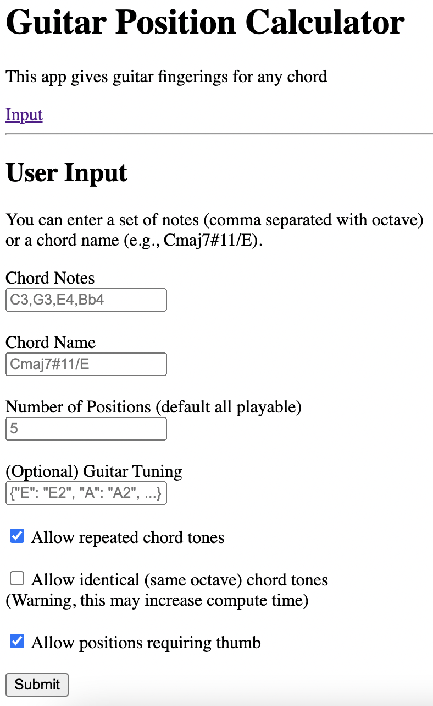

# `music`

Helpers for music.

## `music` Module

Classes include:
- `Note`: define a music note, e.g.: `Note(name='C#', octave=3)`; methods:
  - `guitar_positions`: returns all positions the note can be played for a `Guitar`
  - also includes some helpers like `nearest_above` and `nearest_below`
  - notes can be added (semitones) and compared to other notes
- `Chord`: constructed from a `list[Note]`; methods:
  - `guitar_positions`: returns all positions the chord can be played for a `Guitar`
- `ChordName`: constructed from a string (e.g., `ChordName('C7b9/E')`); methods:
  - `get_all_chords` returns all possible voicings for a chord that fit between a `lower` and `upper` `Note`
- `Guitar`: define a guitar by its tuning and number of frets (can include a capo)
- `GuitarPosition`: the set of fret positions to be played for each string

## Demo

There is a `demo.py` script that will generate guitar chord positions. See `--help` for more info on the args.

### `notes` Mode

In `notes` mode, you must specify the notes (including octave) that you want as a comma-separated string:

```commandline
$ python demo.py --notes C3,G3,E4,Bb4 -n 3
You input the chord: C3,G3,E4,Bb4
There are 9 playable guitar positions (out of 54 possible) for a guitar tuned to standard.
(Computed in 0.00 seconds)
Here are the top 3:
{'E': 8, 'A': 10, 'G': 9, 'B': 11}
{'E': 8, 'D': 5, 'B': 5, 'e': 6}
{'A': 3, 'D': 5, 'B': 5, 'e': 6}
```

### `name` Mode

In `name` mode, you can just pass a chord name (e.g., `Cmaj7#11/E`)

```commandline
 $ python demo.py --name Cmaj7#11/E -n 3
You input the chord: Cmaj7#11/E
There are 25 playable guitar positions (out of 986 possible) for a guitar tuned to standard.
(Computed in 0.01 seconds)
Here are the top 3:
{'E': 0, 'A': 10, 'D': 10, 'G': 11, 'B': 0}
{'E': 0, 'A': 2, 'G': 0, 'B': 1, 'e': 2}
{'E': 0, 'A': 3, 'G': 0, 'B': 0, 'e': 2}
```

### Other features

You can use the `--graphical` (`-g`) flag for ASCII art:

```commandline
$ python demo.py --notes C3,G3,E4,Bb4 --top_n 3 --graphical
You input the chord: C3,G3,E4,Bb4
There are 9 playable guitar positions (out of 54 possible) for a guitar tuned to standard.
(Computed in 0.00 seconds)
Here are the top 3:

e x|---|---|---|---|
B  |---|---|---|-@-|
G  |---|-@-|---|---|
D x|---|---|---|---|
A  |---|---|-@-|---|
E  |-@-|---|---|---|
    8fr

e  |---|-@-|---|---|
B  |-@-|---|---|---|
G x|---|---|---|---|
D  |-@-|---|---|---|
A x|---|---|---|---|
E  |---|---|---|-@-|
    5fr

e  |---|---|---|-@-|
B  |---|---|-@-|---|
G x|---|---|---|---|
D  |---|---|-@-|---|
A  |-@-|---|---|---|
E x|---|---|---|---|
    3fr
```

You can specify different tunings, numbers of frets, and a capo location:

```commandline
$ python demo.py -g \
    --notes C3,G3,E4,Bb4 \
    --top_n 2 \
    --tuning '{"D": "D2", "A": "A2", "d": "D3", "F#": "F#3", "a": "A3", "dd": "D4"}' \
    --capo 1
You input the chord: C3,G3,E4,Bb4
There are 6 playable guitar positions (out of 54 possible) for a guitar tuned to custom ({'D': Eb2, 'A': Bb2, 'd': Eb3, 'F#': G3, 'a': Bb3, 'dd': Eb4}):.
(Computed in 0.00 seconds)
Here are the top 2:

dd  |-@-|---|---|
 a x|---|---|---|
F#  |---|---|-@-|
 d x|---|---|---|
 A  |---|---|-@-|
 D  |---|---|-@-|
     7fr

dd x|---|---|---|---|
 a  |---|---|---|-@-|
F#  |-@-|---|---|---|
 d x|---|---|---|---|
 A  |-@-|---|---|---|
 D  |-@-|---|---|---|
     9fr
```

## Web App

This includes a Flask web app to run a server that will accept user requests and display the chord positions.

Run the app with `uv run app.py`. The main landing page looks like this:



## Environment

To generate a compatible environment with required dependencies, you can use uv 
(see https://docs.astral.sh/uv/getting-started/installation/ for installation):

```commandline
uv sync --frozen --extra media
```

To deploy on Raspberry Pi, it is highly recommended to use `--extra-index-url https://www.piwheels.org/simple` 
when syncing the environment, and to change the `.python-version` to match the system version 
(since PiWheels typically only builds wheels for the sys python version that comes with a given Linux version).

## Dependency Graph

The classes in the `music` project have an interrelationship as defined below, 
where the keys are classes and the values are classes they depend upon.
A longer term goal will be to eliminate circular dependencies from the module.  

```
{
    Note: [Guitar, GuitarPosition],
    Chord: [Note, Guitar, GuitarPosition],
    ChordName: [Note, Chord, Guitar],
    Staff: [Note, Chord],
    Guitar: [Note, Chord],
    GuitarPosition: [Guitar, Note, Chord]
}
```

## TODO

- [x] Add upper extensions
- [x] Add playability heuristics
- [x] Better ranking
- [x] Automated testing
- [x] Allow repeated notes
- [x] Option to remove redundant positions
- [X] Clean up app url
- [x] Optimize compute
- [x] Rename module (`music`?)
- [x] Show voicings on staff
- [x] Add audio
- [ ] Sort on different metrics
- [ ] Better input for specifying tuning
- [ ] Remove circular dependencies
- [ ] Deploy on AWS
- [ ] Request logging
